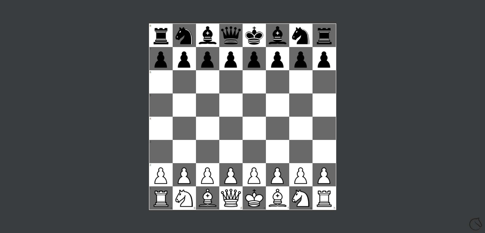

# assistant-skill-chess

webex assistant chess skill

## Flows
In these flows, `UI-SDK` is the client.
### Normal Flow

### Command Flow

## TODO
These are future tasks slated for v2 of the experience.

### PVP Games
Requires websocket skill <-> frontend to receive async player moves (or similar).

### Skill session timeout

When the assistant goes off the screen, the current session/`dialogue_id` is lost. The skill service needs to automatically resume sessions (based on `user_id` if available) or the assistant needs to keep `dialogue_id` while a web view is visible.

### Create a better frontend communication library
Create a library around passing data into skill UI's.

## Sources
[Algebraic Notation](https://en.wikipedia.org/wiki/Algebraic_notation_(chess)) as a way of representing moves.

[chessboard.js](https://chessboardjs.com/) as a chessboard UI framework.

[chess.js](https://github.com/jhlywa/chess.js) as a chess logic library.

[Forsyth-Edwards Notation](https://en.wikipedia.org/wiki/Forsyth%E2%80%93Edwards_Notation) as a way of representing game state.

[lichess.org API](https://lichess.org/api) as a chess backend.
